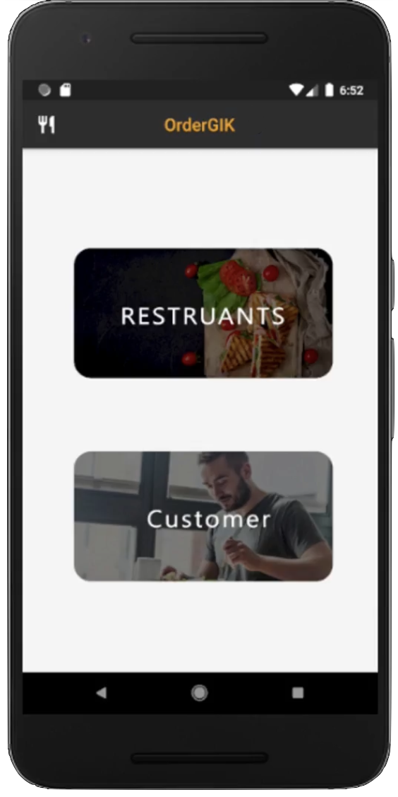

# Food Delivery Project

## Overview
This project is a complete solution for a food delivery service, featuring a mobile app built with Flutter and a backend service using Node.js and MongoDB. It aims to connect customers with restaurants, enabling them to browse menus, place orders, and manage deliveries.

## Features
- User authentication and profile management
- Restaurant listing and search functionality
- Menu browsing and order placement
- Order tracking and history
- Admin panel for restaurant management

## Technology Stack
- **Frontend:** Flutter
- **Backend:** Node.js, Express.js
- **Database:** MongoDB

## Getting Started

### Prerequisites
- Flutter installed for frontend development
- Node.js and npm installed for backend development
- MongoDB setup for data storage

### Setup and Running

#### Backend
1. Navigate to the backend directory: `cd backend`
2. Install dependencies: `npm install`
3. Start the server: `npm start` or `node server.js`

#### Frontend
1. Navigate to the frontend directory: `cd frontend`
2. Install Flutter dependencies: `flutter pub get`
3. Run the app on an emulator or physical device: `flutter run`

## Contribution
Feel free to fork this project and submit pull requests to contribute to its development.
